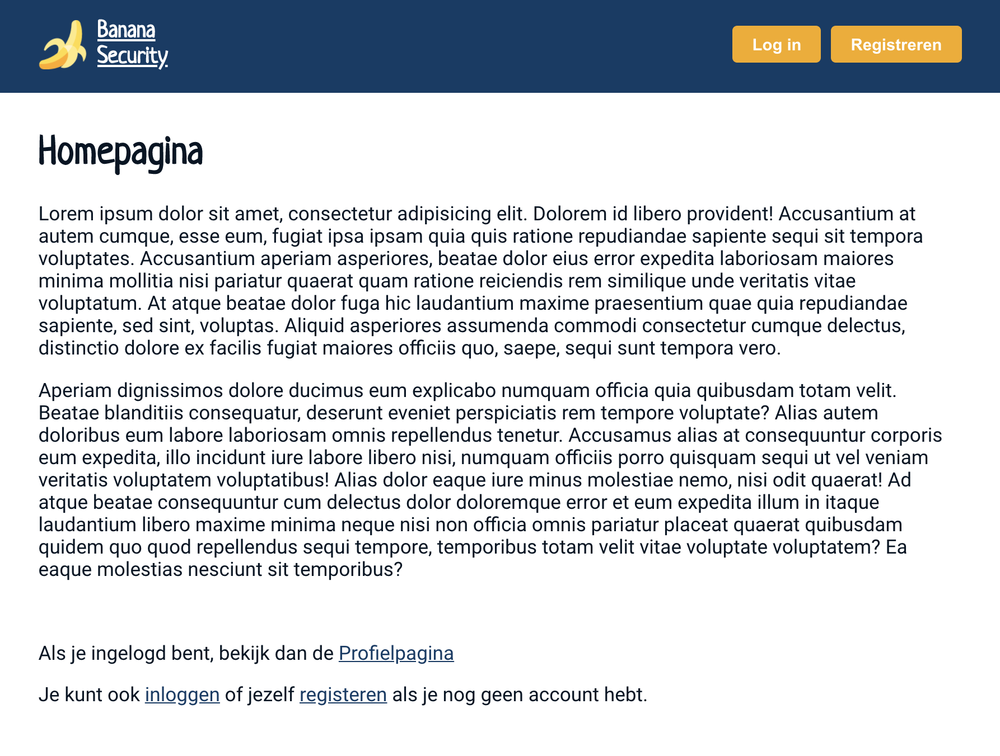

# Opdrachtbeschrijving

## Inleiding

Vorige week heb je het toonaangevende bedrijf Banana Security geholpen met het opzetten van een beveiligde omgeving,
waarin gebruikers konden inloggen. En hoewel de implementatie correct is, is daar ook gelijk alles mee gezegd: je kunt
namelijk **alleen in- en uitloggen**. Gebruikers hebben geen accounts en kunnen ook geen accounts aanmaken... Maar omdat
Banana Security tot nu toe ontzettend blij met je is (je bent immers een stuk sneller
dan [Tim](https://speld.nl/2016/01/08/icter-tim-ging-een-jaar-offline-en-nu-is-hij-ontslagen/)) hebben ze je nogmaals
ingehuurd om de inlog-omgeving helemaal te professionaliseren.

## Applicatie starten

Als je de opdracht van vorige week afgemaakt hebt, kun je gewoon verder werken in jouw eigen project.

## Randvoorwaarden

De applicatie heeft op dit moment al vier pagina's, een beveiligde route en een Context de gebruikers in- en uitlogt. Om
het gebruik van een backend voor het opslaan van gebruikersgegevens en uitgifte van een JWT te veinsen, gebruiken we een
nep database server. Dit is niets meer dan een javascript projectje die zich, doormiddel van een npm package genaamd
`json-server-auth`, gedraagt als een backend met REST endpoints wanneer je het project runt. Je kunt het project hier
clonen. In de README.md van het project staat beschreven hoe je de server kunt starten en welke endpoints er beschikbaar
zijn. Lees dit goed door.

### Registreren

Een gebruiker kan een nieuw account aanmaken door de invoervelden _emailadres_, _wachtwoord_ en _gebruikersnaam_ in te
voeren in het registratieformulier. Dit account wordt in de fake server opgeslagen (zie documentatie over
het `/register` endpoint).

### Inloggen

Na het registeren wordt de gebruiker doorgestuurd naar de login-pagina. De gebruiker kan inloggen door de invoervelden
_emailadres_ en _wachtwoord_ in te vullen. Een gebruiker is ingelogd wanneer de fake server een JWT token terugstuurt (
zie documentatie over het `/login` endpoint). In de context gebeurt dan het volgende:

1. De JWT wordt in de Local Storage geplaatst.
2. `isAuth` wordt op `true` gezet
3. De gebruikersgegevens (gebruikersnaam en emailadres) worden opgehaald en in de context gezet (zie documentatie over
   het `/600/users/:id` endpoint)
4. De gebruiker wordt doorgestuurd naar de profielpagina

### Uitloggen

Wanneer de gebruiker uitlogt, gebeurt het volgende:

1. De JWT wordt uit de Local Storage gehaald
2. `isAuth` wordt op `false` gezet
3. `user` wordt weer `null`
4. De gebruiker wordt doorgestuurd naar de homepagina

### Persist on refresh

Je implementeert persist on refresh door:

* De een `status`-key toe te voegen aan de Context-state
* Tijdens het mounting-effect te checken of er een token aanwezig is in de Local Storage, en áls dat zo is, opnieuw
  gebruikersdata op te halen
* De children van de Context-Provider niet te renderen zoalang de status niet op `done` staat Bekijk hoofdstuk 10.3 op
  EdHub voor een voorbeeld van dit principe.

### Beschermde profieldata ophalen

Je implementeert het ophalen van de gebruikersgegevens op de profielpagina. Het emailadres en gebruikersnaam lees je uit
uit de Context, maar de beschermde content haal je op via een request op de profielpagina zelf. Dit doe je in een
mounting-effect (zie documentatie over het `/660/private-content` endpoint).

Bonus: ook checken of dit nog geldig is enzo

## Stappenplan

Als je niet zo goed weet waar je moet beginnen, kun je onderstaand stappenplan volgen:

1. Maak een context-bestand (`AuthContext.js`) met daarin (je raadt het niet!) een `AuthContext`.
2. Creer dan het custom Provider-component. Uit dit component return je het echte `AuthContext.Provider` component.
3. Zorg ervoor dat we het custom Provider-component zometeen om de applicatie kunnen wikkelen door de children property
   te implementeren.
4. Maak een data-object aan die je meegeeft aan de `value`-property en zet daar wat test-data in.
5. Wrap dit om het `<App />`-component in `index.js`
6. Lees de context uit in één van de pagina-componenten om te kijken of jouw eerste opzet functioneel is (
   met `useContext`)
7. Gelukt? Top. Dan is het tijd om state aan te maken in het custom Provider-component. Noem deze
   state-variabele `isAuth` of `isAuthenticated` en zet de initiële waarde op `false`. Geef de waarde van de state mee
   aan het data object.
8. Lees deze authenticatie-status uit in het `<NavBar />` component. Krijg je het te zien in de console? Zorg er dan
   voor dat je op basis van deze status een inloggen- en registreren-knop laat zien, **of** alleen een uitlog-knop.
9. Schrijf een inlog-functie in het custom Provider-component en maak deze beschikbaar in het data-object. In de
   randvoorwaarden staat beschreven wat deze functie moet doen.
10. Maak de knop in het formulier in `SignIn.js` functioneel. Als het formulier wordt _gesubmit_, roep je de
    login-functie uit de context aan!
11. Schrijf een uitlog-functie in het custom Provider-component en maak deze beschikbaar in het data-object. In de
    randvoorwaarden staat beschreven wat deze functie moet doen.
12. Maak de knop in de navigatie (`NavBar.js`) functioneel. Als erop wordt geklikt, roep je de logout-functie uit de
    context aan!
13. Ten slotte kun je de route naar `/profile` beveiligen met een private route.

## Bonus-opdrachten

**Bonus:**

* Maak alvast invoervelden in het login- en registratie-formulier die de gebruiker zou kunnen invullen. Je hoeft nog
  niets met de ingevulde data te doen, dit komt pas volgende les!

**Advanced bonus:**

* Breidt de state uit van een boolean naar een object. De initiele waarde moet er zo
  uitzien: `{isAuth: false, user: ''}`
* Nu de state een object is, werkt het togglen van `isAuth` natuurlijk ook anders in de login- en logout-functie. Pas
  dit aan zodat het weer werkt!
* Zorg ervoor dat de inhoud van de state (dus de keys `isAuth` en `user`) worden doorgegeven in het data-object.
* Zorg er dan nu voor dat de _gebruikersnaam_ wordt meegegeven bij het aanroepen van de login functie vanuit `SignIn.js`
* Zorg ervoor dat er in het custom Provider-component voor gezorgd wordt dat die gebruikersnaam wordt opgeslagen
  onder `user` in de state.
* Laat, als er een gebruiker is ingelogd, de gebruikersnaam zien in de navigatie.